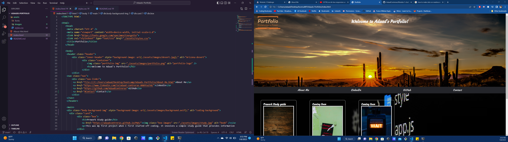

# Adaads-Portfolio

Personal Porfolio was created to showcase work to allow future company's to look into my projects and understand If I would be a great candidate for their open position.

## Description

Using HTML and CSS I created my own personal portfolio to showcase my work for future career opportunities.

* Links and images were added to give a more defined look and to make navigation more simple. 
* Contact info can be found on the nav bar and footer with easy access from the nav bar. 
* Ensured website is responsive with all screens from any device.
* As projects get created I will be constantly updating my portfolio and ensure everything is up to date.

## Screenshot/Deployed Website

Deployed Portolio Website: 
https://adaadcontreras.github.io/Adaads-Portfolio/

Deployed About Me Website:
https://adaadcontreras.github.io/About-Me/
